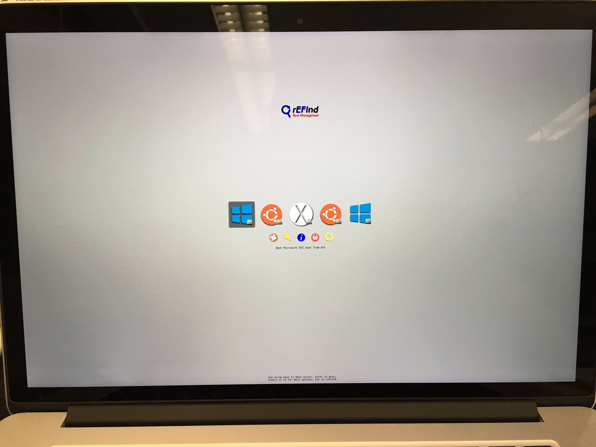

# Triple booting OS X, Windows 8.1, and Ubuntu 14.04 on a MacBook Pro

This page describes how to configure a 2015 MacBook Pro to triple boot OS X 10.11 (El Capitan), Windows 8.1, and Ubuntu 14.04 LTS. It assumes that you have a clean, working installation of OS X 10.11 El Capitan already installed. If you prefer to start with a clean hard drive and reinstall OS X, follow the steps under Installing OS X below; otherwise, skip ahead to Installing Windows 8.1.

This protocol was successful as of Sept. 13, 2016 and was performed on a 15" 2015 MacBook Pro with Intel i7 processor, 16 GB RAM, and a 1 Terabyte hard drive. In theory, this procedure should work on any Apple computer capable of running El Capitan.

## tl;dr?

**The basic steps are as follows (see below for details):**

1.  From OS X, install Windows 8 via Boot Camp, providing only the disk space you need for Windows.

2.  Deactivate Core Storage on the primary OS X partition (so that it can be resized).

3.  Resize the primary OS X partition, leaving empty space between it and your Windows (i.e. BOOTCAMP partition).

4.  Install Ubuntu on (part of) the newly created empty space.

5.  Use GPT fdisk to change the master boot record (MBR) from hybrid (which the Ubuntu installation inevitably creates) to protective; otherwise, Windows will fail to boot.

6.  In OS X, format the remaining disk space (if any) as FAT for shared data storage.

7.  Change the primary user's UID in Ubuntu such that the shared FAT data partition is readable and writable across all three operating systems.

8.  In OS X, install rEFInd to enable operating system selection at boot.

## Required:

*   a stable Internet connection, preferably wired. Apple's USB Ethernet adapter was recognized by all 3 operating systems and worked reliably during setup.

*   a downloaded `.iso` file of Windows 8.1 (does not require its own dedicated thumb drive or partition).

*   a dedicated Ubuntu 14.04 installation USB stick. Instructions for making one can be found [here](https://help.ubuntu.com/community/How%20to%20install%20Ubuntu%20on%20MacBook%20using%20USB%20Stick) (follow instructions under Manual Approach).

*   administrator privileges.

*   sufficient disk space for each OS.

*   about 1.5 hours to get everything installed.

*   a connection to AC power.

*   a common username across all operating systems.

## Optional:

*   a USB mouse for right-clicking in Windows and Ubuntu while you're setting things up.

*   additional disk space for a shared data partition

*   a printed copy of these instructions :)

## Required (but hopefully obvious) disclaimers

*   I am not a computer expert. But I did stay at a Holiday Inn Express last night.

*   **BACK UP ALL IMPORTANT DATA** before proceeding!

## Installing OS X

###  Create bootable OS X installer

Find a USB stick or external hard drive with at least 8 GB capacity, and transfer any important data off of it as this procedure will erase the disk.

From the App Store, download OS X El Capitain *but do not begin the installation process*. In Finder, open Applications. You should see an app called "Install OS X El Capitan." Insert your (bootable) USB stick or external hard drive and open Finder to determine the name of your external disk. If you prefer, you can also erase the disk using Disk Utility and simply select the default "Untitled" name. The command below assumes the disk is named "Untitled" but modify as needed. Open Terminal and type: (**NOTE:** this will erase the disk!):

    sudo /Applications/Install\ OS\ X\ El\ Capitan.app/Contents/Resources/createinstallmedia --volume /Volumes/Untitled --applicationpath /Applications/Install\ OS\ X\ El\ Capitan.app --nointeraction

and replace `/Volumes/Untitled` with the name of your external disk.

### Install OS X (if not already installed)

Reboot the computer and, with your installer disk connected, hold down the Option key. You will see a menu with different boot options. Select the yellow icon labeled "Install OS X El Capitan."

When the installer loads, run Disk Utility. Select your internal hard drive and click "erase." Give the disk a name, and select GUID partition table and OS X Extended (Journaled). When the command completes, quit Disk Utility.

Select "Install OS X" from the menu and select your hard disk (i.e. the one you just erased and reformatted) as the installation target. The system will reboot and eventually ask you for configuration/preferences. **DO NOT transfer any files at this time.** Do not enable FileVault encryption.

## Install Windows 8.1

A few other online tutorials for triple booting call for arresting the Windows Boot Camp installation process in order to install Ubuntu. None of them worked for me. I could only get Windows booting properly if I let Boot Camp run from start to finish, without interruption. Boot Camp requires that the destination hard drive have only one partition, and so Windows needs to be installed *before* Ubuntu. (This is a bit misleading, since an OS X-only partition actually has 3 partitions: the EFI system partition (ESP), the OS itself, and the OS X recovery partition. See for yourself: before proceeding, open a Terminal and type `diskutil list`.)

1.  Open Applications --> Utilities --> Boot Camp Assistant.

2.  Select the `.iso` file you downloaded for Windows 8.1.

3.  Drag the slider to give **only as much disk space as you want for Windows**. In my case, I left ~60 GB for Windows at the end of the disk.

4.  Click continue. Boot Camp Assistant will download the required software and drivers, and will reboot automatically into the Windows 8.1 installer.

5.  Follow the prompts and select the option to customize the installation. You will then be shown a list of partitions. **DO NOT** add or remove any partitions. Click on the advanced options button, then select `Disk 0 Partition 5: BOOTCAMP`, and click Format. This will erase the Boot Camp partition that the Assistant created and reformat it as NTFS.

6.  Select `Disk 0 Partition 5: BOOTCAMP` and click Next.

7.  Grab a cup of coffee while Windows finishes its installation. It will reboot several times.

8.  The Windows installer will eventually bring up a Boot Camp dialog box. Click through the prompts to install drivers. When the Boot Camp installer finishes, click Reboot.

You should now have a stable dual-boot system, and (for the time being) there are two ways of selecting which OS you want to boot:

*   Press and hold the Option key on reboot

*   Select the Startup Disk before you reboot. In OS X, go to System Preferences --> Startup Disk, and select BOOTCAMP. In Windows, search for 'boot camp' and open the Windows version of the same utility; it can also be accessed via Control Panel.

**Before you proceed,** make sure that you can safely reboot into both Windows and OS X.

## Prepare for Ubuntu Installation

By default, Apple does not allow existing partitions to be resized. This is because OS X occupies a "Core Storage" partition, which Google tells me no one really understands. Fortunately, this can be disabled.

To review, we now have OS X taking up the first 940 GB, with Windows 8.1 taking up the last 60 GB. We want to shrink the existing OS X partition without modifying anything else.

1.  Open a Terminal (Applications --> Utilities --> Terminal) and type:

        diskutil cs list
 
    You should see an output that looks something like this:

        CoreStorage logical volume groups (1 found)
        |
        +-- Logical Volume Group C2356C06-A89F-4334-AE29-D7390FB36A11
            =========================================================
            Name:         mac
            Status:       Online
            Size:         918372315136 B (918.4 GB)
            Free Space:   18984960 B (19.0 MB)
            |
            +-< Physical Volume CB7CE669-6B7C-44C4-9EC3-71E9A6072BF3
            |   ----------------------------------------------------
            |   Index:    0
            |   Disk:     disk0s2
            |   Status:   Online
            |   Size:     918372315136 B (918.4 GB)
            |
            +-> Logical Volume Family EA474DAB-C993-4A67-8DC8-18E4B1BF06E1
                ----------------------------------------------------------
                Encryption Type:         None
                |
                +-> Logical Volume B3ECE9A1-8E51-444B-9D46-9E470BC92BC4  <---- COPY THIS STRING
                    ---------------------------------------------------
                    Disk:                  disk1
                    Status:                Online
                    Size (Total):          918001008640 B (918.0 GB)
                    Revertible:            Yes (no decryption required)  <--- This must say 'yes'
                    LV Name:               mac
                    Volume Name:           mac
                    Content Hint:          Apple_HFS

2.  You should see a revertible logical volume. In a Terminal window type

        diskutil cs revert B3ECE9A1-8E51-444B-9D46-9E470BC92BC4

    where `B3ECE9A1-8E51-444B-9D46-9E470BC92BC4` is the UUID for your logical volume.

3.  Reboot.

4.  Reopen Terminal and type `diskutil list` to show all of your current disks and partitions.

5.  Type `diskutil cs list`. The output should say

        No CoreStorage logical volume groups found

6.  Reboot again, but this time boot into Recovery Mode by holding down Command + R as the system boots.

7.  Disable System Integrity Protection. This is required for installing GPT fdisk and rEFInd below. This is a security feature Apple introduced with El Capitan that protects certain low-level system directories, but fortunately this can be disabled. Within Recovery Mode, select Terminal from the Utilities pulldown menu and type

        csrutil disable
        reboot

8. The computer should boot normally into OS X. Let's check our disk partitioning scheme again with `diskutil list`:

        /dev/disk0 (internal, physical):
           #:                       TYPE NAME                    SIZE       IDENTIFIER
           0:      GUID_partition_scheme                        *1.0 TB     disk0
           1:                        EFI EFI                     209.7 MB   disk0s1
           2:                  Apple_HFS mac                     938.4 GB   disk0s2
           3:                 Apple_Boot Recovery HD             650.0 MB   disk0s3
           4:       Microsoft Basic Data BOOTCAMP                61.3 GB    disk0s4
        
9. Make note of the identifier for your primary OS X partition, in this case `disk0s2`.

10. In Terminal type

        diskutil resizeVolume /dev/disk0s2 80G
    
    and resize your OS X partition to whatever size you want.

## Install Ubuntu 14.04 LTS

1.  Shut down the computer, disconnect all unnecessary peripherals, and insert a bootable USB Ubuntu installation disk.

2.  Turn on the computer. Immediately press and hold the Option key and wait for external devices to appear. Select your Ubuntu installation media.

3.  Select 'Try Ubuntu without installing'.

4.  When the Ubuntu desktop appears, click the 'Install Ubuntu' desktop icon.

5.  Follow the prompts until the Installation Type dialog box appears. Select 'something else.'

6.  You will see a listing of existing partitions (and available free space) on `/dev/sda`. Create (at minimum) the following in the ~860 GB of available disk space:

    *   16 GB swap area
    
    *   24 GB ext4-formatted space for the `/` partition (or whatever size you prefer)
    
    *   the remaining free space as 'unformatted'
    
7.  Note the number of the `/` partition you just assigned. For me it was `/dev/sda6`.

8.  From the pulldown 'device for bootloader installation', select whatever you identified in step 7.

9.  Click Next to verify your configuration and Install Ubuntu. Restart when prompted. The computer *should* reboot into OS X; if it does not, reboot again and hold down the Option key to select OS X.

## Repair the hybrid MBR created during Ubuntu installation

Rod Smith is an expert on this topic so I'll simply defer to his tools for tackling boot issues and inconsistencies across different hardware and operating systems.

Despite telling Ubuntu to put its bootloader on its own partition, the installation screws with the Master Boot Record (MBR) such that Windows would no longer boot for me, even after verifying above that it could. Ubuntu creates an unstable hybrid MBR that needs to be restored to a more stable protective MBR.

1.  Download and install [GPT fdisk](https://sourceforge.net/projects/gptfdisk/files/latest/download).

2.  In Terminal, type

        sudo gdisk /dev/disk0
        
    which should show the MBR as hybrid.
        
3.  Then type the following, pressing Enter after each letter:

        p  (to print the current MBR configuration)
        x  (to enter expert mode)
        n  (to create a new protective MBR)
        w  (to write the new configuration)

4.  Type

        sudo gdisk /dev/disk0
    
    again and now the MBR should be listed as protective.
    
## Install rEFInd

rEFInd is another awesome tool from Rod Smith that streamlines the multi-boot configuration, providing a handy list of options at startup.

1.  Download [rEFInd](https://sourceforge.net/projects/refind/files/0.10.3/refind-bin-0.10.3.zip/download).

2.  Assuming OS X automatically unzips the file, open Terminal and type

        cd ~/Downloads/refind-bin-0.10.3
        sudo ./refind-install
        
    That's it! Try rebooting and you should see something like this:
    
    

3.  Verify that you can boot into each OS.

## Create a shared data partition (optional)

The original intent of this procedure was to configure a MacBook Pro for DNA sequencing using the Oxford Nanopore [MinION](https://nanoporetech.com/products/minion). Its MinKNOW software runs best on Windows, but most bioinformatics tools are *NIX-based. I wanted a completely portable system that enabled remote data acquisition and analysis via a shared data partition comprising the bulk of the 1-TB PCIe hard drive. Ideally this partition should be readable and writable from all 3 operating systems.

1.  In OS X, open Disk Utility.

2.  Select the hard drive, and click Partition. **DO NOT erase or modify any of the existing OS partitions.**

3.  Click on the pie slice corresponding to the large chunk of unformatted space in the middle of the disk left after installing Ubuntu.

4.  Give that slice a name (e.g. DATA) and select FAT as the file system. Click OK. 

5.  In a Terminal type

        diskutil list
        
    to see the hard disk configuration.

## Make the new DATA partition play nice with Ubuntu

Rather than your username, your UID is more important for establishing compatibility of files and permissions between OS X and Ubuntu. By default, your UID in OS X is 501, but in Ubuntu, your default UID is 1001. Fortunately, this can be changed:

1.  Boot into Ubuntu.

2.  In System Preferences, create a temporary user account with administrator privileges.

3.  In a terminal, type

        sudo passwd temp
        
    where `temp` is the temporary username you just created. Enter a temporary password - it doesn't matter what it is, because you'll soon delete this user.

4.  In a terminal, type

        sudo gedit /etc/login.defs
        
    look for the line (Ctrl + F works) containing `UID_MIN` and change its value to 500. Save changes and quit Gedit.
    
5.  Reboot back into Ubuntu. **Log in as the temporary user you just created.**

6.  Open a terminal window and type

        sudo usermod -u 501 username
        
    where `username` is your primary username.
    
7.  Reboot back into Ubuntu and login as your primary username.

8.  In a terminal window type

        id -u username
        
    where `username` is your primary username. Verify that your UID has been changed to 501.

9.  In System Preferences, delete the temporary user account you created in Step 2.

## Odds and Ends

*   The FAT-formatted `DATA` partition you created should auto-mount in Ubuntu at `/media/username/DATA`. Try making a short plain text file and save it to that partition. Then reboot into OS X and add another line to the file. Then boot into Windows and verify that the file is readable and writeable across each OS.

*   Once you have each OS up and running, **install any recommended OS updates** and configure each OS as you wish. 

*   Shameless plug: I have a detailed guide [here](https://github.com/jbadomics/install_help/blob/master/OSX_for_bioinformatics.md) for getting OS X set up for bioinformatics.

*   If duplicate boot menu options are bugging you, you can customize your rEFInd configuration. Details [here](http://www.rodsbooks.com/refind/themes.html).
        